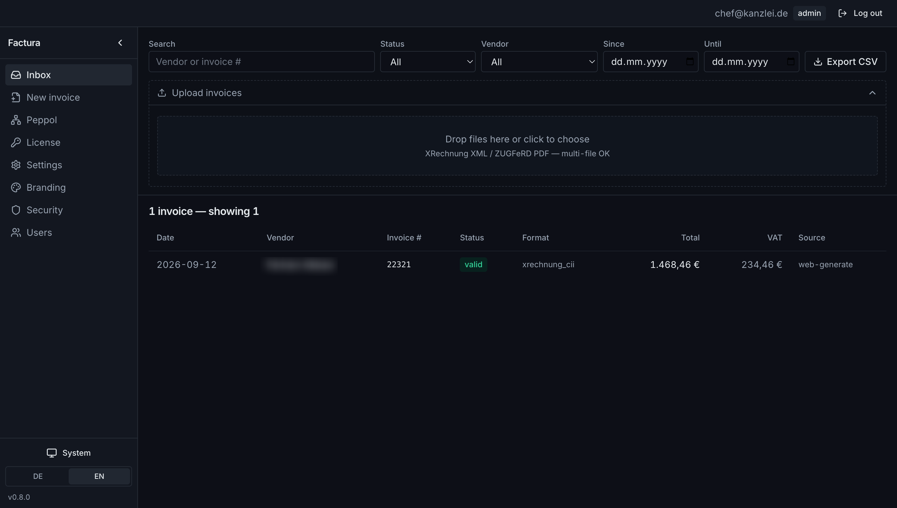
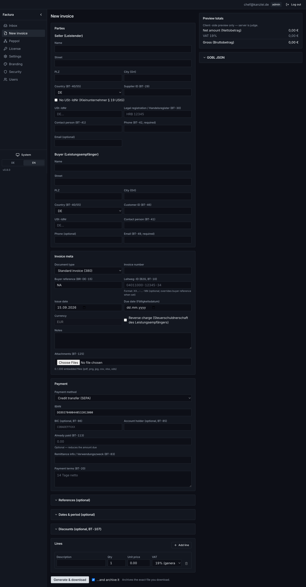
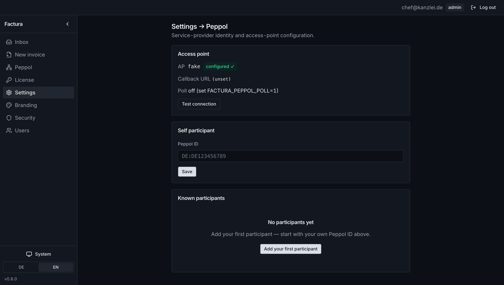
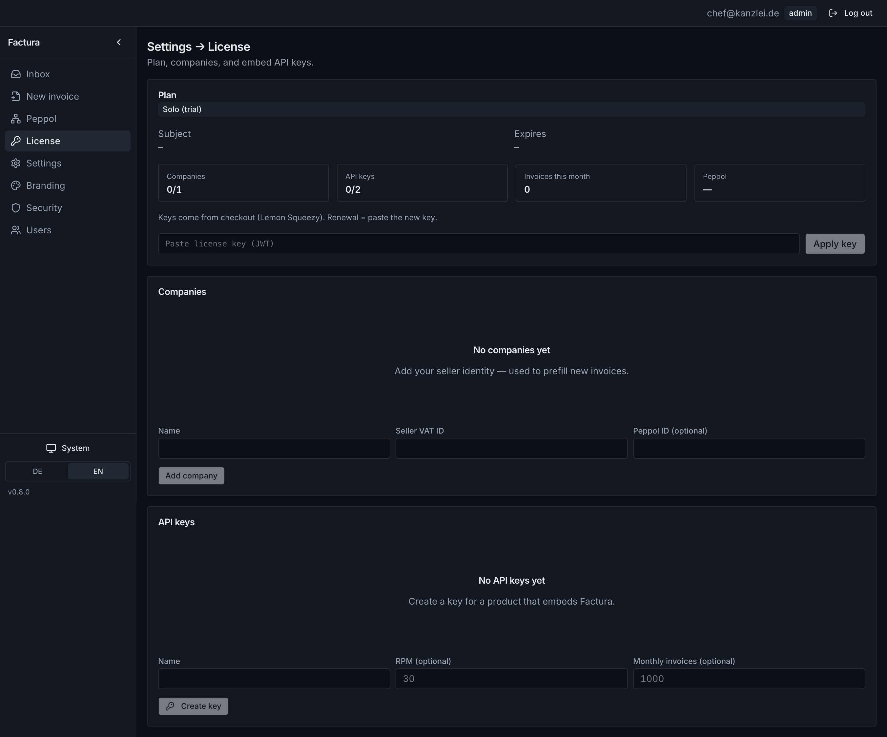
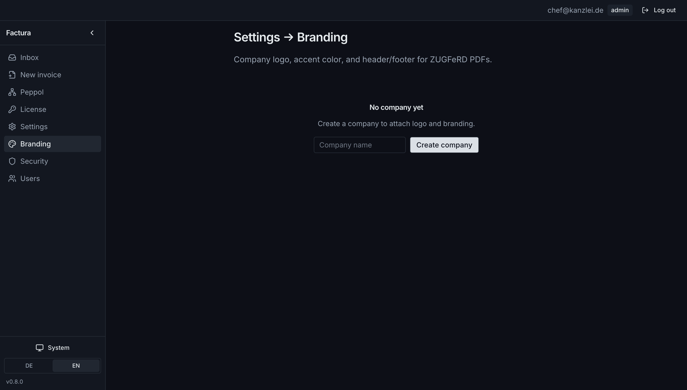
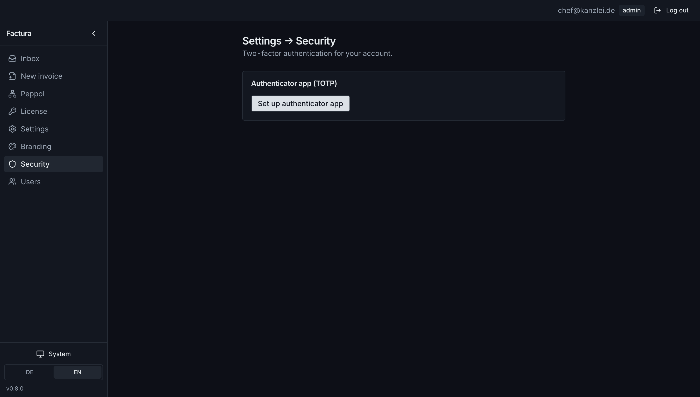
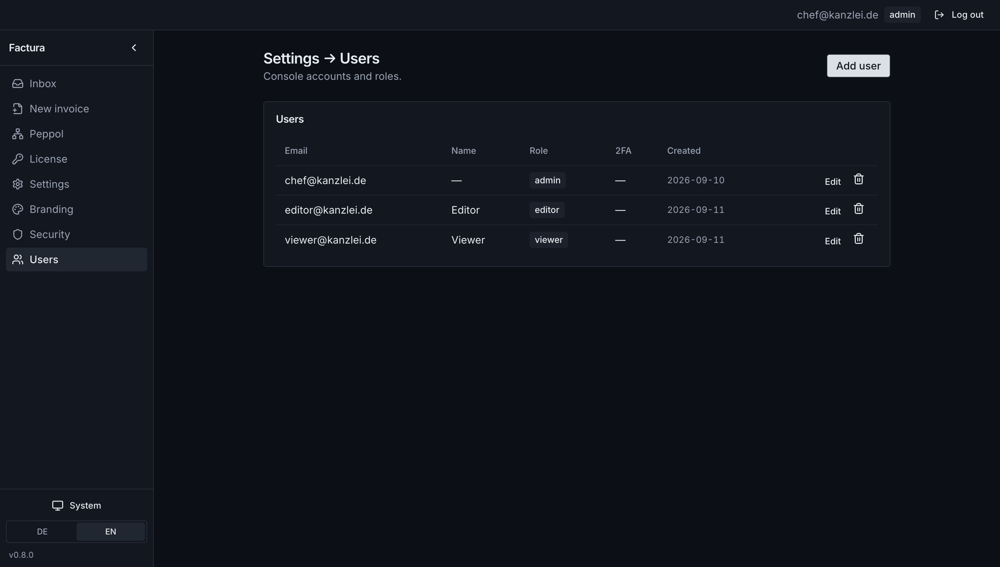

# Factura

**The self-hosted e-invoicing engine for the EU mandate.**

One static Go binary (CGO_ENABLED=0). Receive, validate, archive, and issue
structured e-invoices — **XRechnung 3.0.2** and **ZUGFeRD 2.3 / Factur-X** —
fully offline. Your invoices never leave your box; one-time license (Lemon
Squeezy), no per-invoice SaaS fee.

Source: [github.com/devthinker-ai/factura](https://github.com/devthinker-ai/factura)



*Compliance console inbox: filter and search the archive, drop XRechnung XML / ZUGFeRD PDF, export CSV.*

- Changelog: **[CHANGELOG.md](CHANGELOG.md)**
- Embed / vendor contract: **[docs/EMBED.md](docs/EMBED.md)**
- Licensing: **[docs/licensing.md](docs/licensing.md)**
- Stack: Go 1.26 · modernc.org/sqlite · GOBL + `gobl.cii`/`gobl.ubl` +
`go-xinvoice(-pdf)` · `go-chi/chi/v5` · Vite/React console at `/app/`

## 5-minute quickstart

```bash
docker run -p 8080:8080 -v factura-data:/data \
  ghcr.io/devthinker-ai/factura:latest
```

> Published on each `v*` GitHub release (see `.github/workflows/release.yml`). If the
> image is not on GHCR yet: `docker build -t factura . && docker run -p 8080:8080 -v factura-data:/data factura`.

1. Open [http://localhost:8080/app/](http://localhost:8080/app/) — empty install is **open** (no login yet)
2. **Users** → create the first admin (email + password, ≥ 10 chars; role must be `admin`)
3. Sign in at `/app/login` with that email and password
4. Drop an XRechnung / ZUGFeRD into the inbox, or issue a new invoice

**Total: about five minutes, zero other tooling** (image from GHCR; archive persists in the volume).



*Issue flow: seller/buyer parties, EN 16931 fields, line items, live totals preview, generate & archive.*

Or build from source:

```bash
make build
./bin/factura user add \
  --email admin@example.com --name Admin --role admin --password 'changeme123'
./bin/factura serve --addr 127.0.0.1:8080
```

Then open [http://127.0.0.1:8080/app/](http://127.0.0.1:8080/app/) and sign in.

CLI-only smoke (no UI):

```bash
./bin/factura validate testdata/xrechnung-302-cii.xml
./bin/factura archive add testdata/xrechnung-302-cii.xml
```

## Self-hosted service

```bash
# local
make run
# or
./bin/factura serve --addr 127.0.0.1:8080

# compose (same image as the quickstart)
docker compose up -d

# or build the image yourself
docker build -t factura .
docker run --rm -p 8080:8080 -v factura-data:/data factura
```

Bind to `127.0.0.1` by default in production and terminate TLS at a reverse
proxy. The compliance console is same-origin at `/app/` (`GET /` redirects
there). CORS is not enabled.

### Auth & rate limit

| Env                  | Effect                                                                          |
| -------------------- | ------------------------------------------------------------------------------- |
| `FACTURA_TOKEN`      | If set, all routes except `GET /health` require `Authorization: Bearer <token>` |
| `FACTURA_RATE_LIMIT` | Req/min when auth is on (default `60`)                                          |
| `FACTURA_ADDR`       | Listen address (default `:8080`)                                                |
| `FACTURA_DB`         | SQLite path (default `./factura.db`; Docker image sets `/data/factura.db`)      |

Console login uses local users (argon2id + optional TOTP): email + password
(min 10 chars). On a fresh install the console is **open** until the first
admin is created (Users in the sidebar, or `factura user add`, or public
`POST /users` with role `admin`). That flips the install to login mode.
`FACTURA_TOKEN` is a separate Bearer gate for API clients — not the console
password.

### Endpoints

| Method | Path                         | Notes                                                                                                                |
| ------ | ---------------------------- | -------------------------------------------------------------------------------------------------------------------- |
| `GET`  | `/`                          | 302 → `/app/`                                                                                                        |
| `GET`  | `/app/*`                     | Embedded SPA (compliance console)                                                                                    |
| `GET`  | `/health`                    | Public liveness `{"status":"ok","version":"…"}`                                                                      |
| `POST` | `/invoices`                  | Raw XML/PDF body → archive. **201** valid/invalid, **415** parse_error (still stored), **409** duplicate external id |
| `POST` | `/invoices/validate`         | Dry-run report, no archive                                                                                           |
| `GET`  | `/invoices`                  | `?status=&vendor=&q=&since=&until=&limit=&offset=` → `{rows,total}`                                                  |
| `GET`  | `/invoices/vendors`          | `?limit=` → `{vendors:[…]}` distinct non-empty names                                                                 |
| `GET`  | `/invoices/{id}`             | Full row incl. `report_json` + `doc_gobl_json`                                                                       |
| `GET`  | `/invoices/{id}/original`    | Original bytes                                                                                                       |
| `GET`  | `/invoices/export`           | CSV (header ends with `source`)                                                                                      |
| `POST` | `/invoices/generate`         | GOBL JSON → XR + ZUGFeRD (JSON or `?download=1`)                                                                     |
| `POST` | `/invoices/generate/preview` | Same as generate, HTTP 200                                                                                           |
| `POST` | `/peppol/inbound`            | AP callback — BIS 3.0 SBD → ingest + GoBD message row                                                                |
| `GET`  | `/peppol/inbound`            | Poll AP → ingest (`{"new":[…]}`)                                                                                     |
| `POST` | `/peppol/send`               | Validate → wrap → AP → archive receipt (**201** / **422** / **424** / **502**)                                       |
| `GET`  | `/peppol/messages`           | Ledger (`?direction=in|out`)                                                                                         |
| `GET`  | `/peppol/status`             | Self id, AP name, counts                                                                                             |

### Peppol

Factura is a **Service Provider** behind one swappable Access Point (not an AP
itself). Peppol send/receive is a **Pro / Kanzlei** plan gate. Use
`--peppol-fake` or `FACTURA_PEPPOL_AP=fake` for offline demos:

```bash
./bin/factura serve --peppol-fake --addr 127.0.0.1:8080
# register self + a buyer, then POST a BIS envelope to /peppol/inbound
factura peppol participants add --id DE:SELF --self --db ./factura.db
```

Env: `FACTURA_PEPPOL_AP` (`fake`|`http`), `FACTURA_PEPPOL_AP_URL`,
`FACTURA_PEPPOL_AP_KEY`, `FACTURA_PEPPOL_SELF_ID`, `FACTURA_PEPPOL_CALLBACK_URL`,
`FACTURA_PEPPOL_POLL=1` (+ `FACTURA_PEPPOL_POLL_INTERVAL`).



*Peppol SP settings: Access Point health, self participant id, known counterparties.*

**Idempotency:** set `X-Factura-External-ID` on `POST /invoices`. Retries with
the same id return **409** with the existing archive id — safe for mail relays.

Optional `X-Factura-Source` (e.g. `mail-relay:order@acme.de`) is stored in
`source` and appears in CSV export.

### Mail-relay recipe

Drop-folder cron or Postfix `content_filter` / dovecot sieve can POST any
attachment:

```bash
curl -s -X POST --data-binary @invoice.xml \
  -H 'X-Factura-External-ID: acme-INV-2026-0042' \
  -H 'X-Factura-Source: mail-relay:order@acme.de' \
  -H "Authorization: Bearer $FACTURA_TOKEN" \
  http://127.0.0.1:8080/invoices
```

### Watch / batch (zero-integration inbox)

```bash
factura batch /var/invoices/inbox --source batch:inbox
factura watch /var/invoices/inbox --interval 10s
```

Files are never deleted or moved (read-only scan). Duplicates print
`duplicate <file> id=N` and exit 0.

## Console



*License page: Solo / Pro / Kanzlei caps, companies registry, machine API keys for SaaS embed.*



*Per-company branding for hybrid PDFs: logo, accent, header/footer.*



*Authenticator-app 2FA for console accounts.*



*Console users with admin / editor / viewer roles.*

## Licensing

Offline RS256 license JWTs (`FACTURA_LICENSE_KEY` or Settings → License).
Unlicensed installs **fail open to Solo** (1 company, no Peppol). See
[docs/licensing.md](docs/licensing.md).

**Two different things are licensed:**

1. **The code — Apache-2.0** ([LICENSE](LICENSE)). Free to use, modify, and redistribute.
2. **The license key — commercial.** One-time purchase unlocks Pro/Kanzlei caps.
